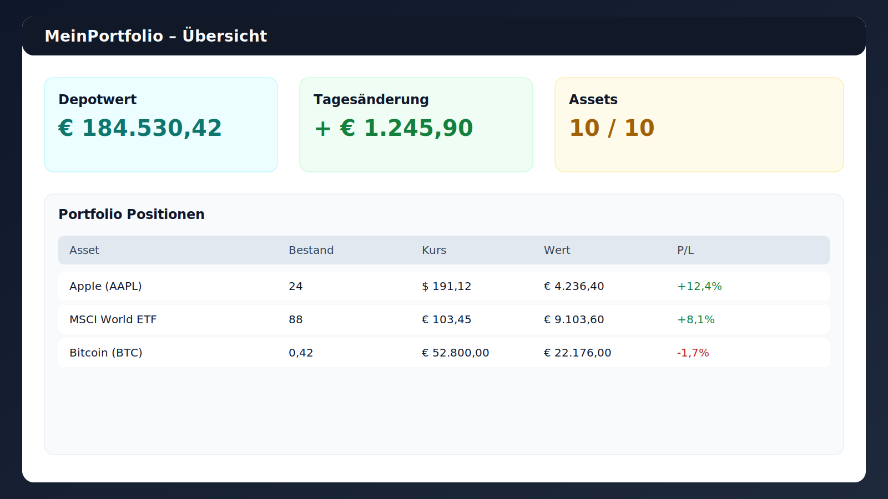
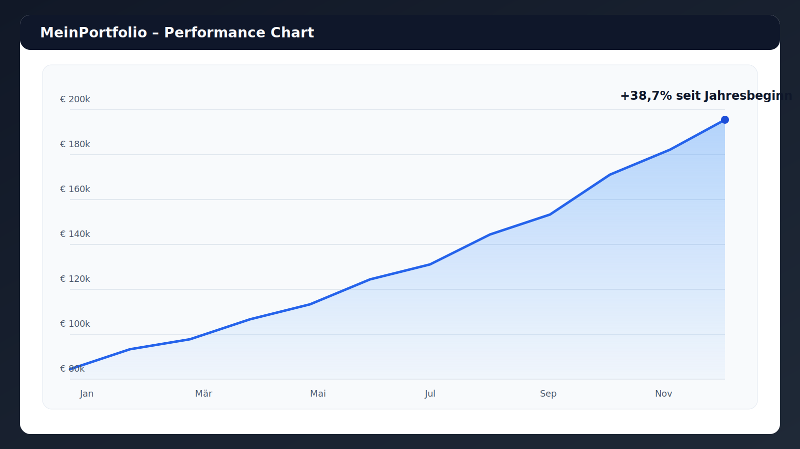
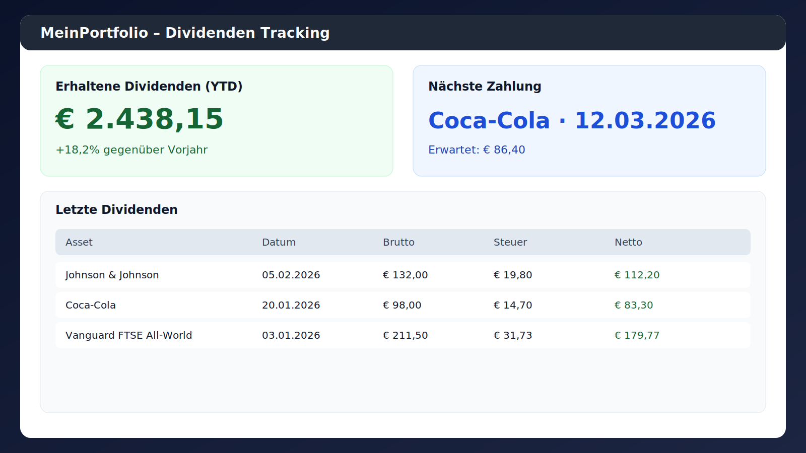

# 💼 Portfolio-Manager

> Professionelle Desktop-Anwendung für Aktien-, ETF- und Krypto-Portfolio-Verwaltung

Portfolio-Manager für Windows mit Fokus auf einfache Erfassung, Performance-Überblick und lokale Datenspeicherung.


## ✨ Features

### Aktuelle Funktionen
- ✅ Portfolio-Tracking für bis zu 10 Assets
- ✅ Manuelle Kurseingabe
- ✅ Gewinn/Verlust-Berechnung
- ✅ Basis-Charts und Diagramme
- ✅ CSV Import/Export
- ✅ Automatische Backups

## 📸 Screenshots





## 🚀 Installation

### Option 1: Windows Installer (Empfohlen)
1. Download: [PortfolioManager-Setup-v1.0.0.exe](https://github.com/IhrUsername/portfolio-manager/releases/latest)
2. Doppelklick auf die .exe
3. Folge dem Installations-Assistenten
4. Fertig! 🎉

### Option 2: Portable Version
1. Download: [PortfolioManager-v1.0.0-Portable.zip](https://github.com/IhrUsername/portfolio-manager/releases/latest)
2. Entpacke das ZIP
3. Führe `PortfolioManager.exe` aus

### Option 3: Von Quellcode (Entwickler)
Hinweis: Markdown-Zeilen wie `# ...`, `## ...`, `- ...` oder `![...]` werden nicht im Terminal ausgeführt.
Führe nur die Befehle innerhalb des Codeblocks aus.

```bash
# In den Projektordner wechseln (anpassen falls dein Pfad anders ist)
cd C:\Users\Janni\OneDrive\Desktop\Private\Privatbereich\Aktien

# Virtual Environment erstellen
python -m venv venv
venv\Scripts\activate

# Dependencies installieren
pip install -r requirements.txt

# Anwendung starten
python main.py
```

Optional (nur wenn du wirklich von GitHub klonen willst):

```bash
git clone https://github.com/<USERNAME>/<REPO>.git
cd <REPO>
```

## 📄 Lizenz

Dieses Projekt ist unter der **PolyForm Noncommercial License 1.0.0** lizenziert und darf ausschließlich nicht-kommerziell genutzt werden.
Die vollständigen Lizenzbedingungen findest du in [LICENSE](LICENSE).